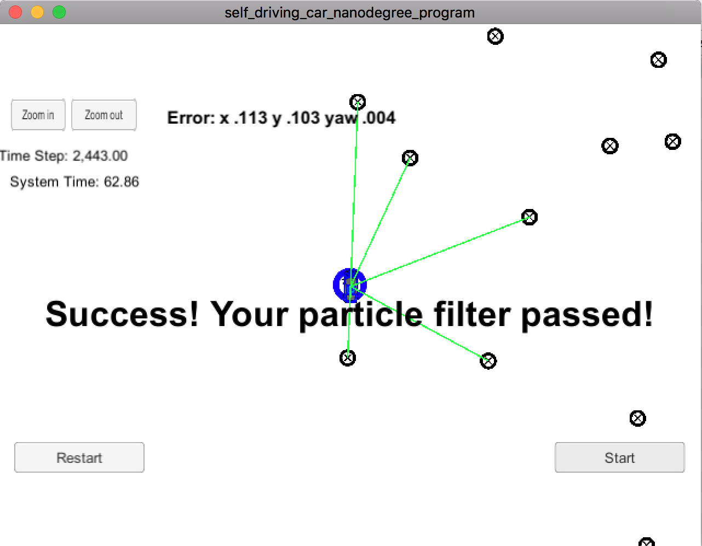

# Kidnapped Vehicle Project
Self-Driving Car Engineer Nanodegree Program

### 1. Project Overview
Your robot has been kidnapped and transported to a new location! Luckily it has a map of this location, a (noisy) GPS estimate of its initial location, and lots of (noisy) sensor and control data.

In this project you will implement a 2 dimensional particle filter in C++. Your particle filter will be given a map and some initial localization information (analogous to what a GPS would provide). At each time step your filter will also get observation and control data.
### 2. Meet the Criteria

2.1 Accuracy:
The final error is: x:0.113, y:0.103, yaw:0.004, and these are within the accuracy criteria. Please find the screenshot in this repo "Result_ScreenShot.png".

2.2 Performance:
The final use of time is 62.86 sec, within the 100 sec criteria. Also this can be found in the screenshot.

2.3 General:
The particle filter is implemented in the particle_filter.cpp, mainly following the methods introduced in the previous two classes. Also, number of particles has been tuned, starting from 20 particles, that still can meet the accuracy (x:0.130, y:0.127, yaw:0.004, time: 49sec), up to 100 particles (used right now), and 500 particles (x:0.109, y:0.102, yaw:0.003, 63sec) that the result almost saturated, and even up to thousands of particles that the accuracy was slightly improved but ran out of time. So finally I think the accuracy result mostly yielded around 100 particles for this project, and the running time is within the requirement, so I submit it using this value.

### 3. Appendix
-- copied from original README to set up enviroment.
This repository includes two files that can be used to set up and intall uWebSocketIO for either Linux or Mac systems. For windows you can use either Docker, VMware, or even Windows 10 Bash on Ubuntu to install uWebSocketIO.

Once the install for uWebSocketIO is complete, the main program can be built and ran by doing the following from the project top directory.

mkdir build
cd build
cmake ..
make
./particle_filter
